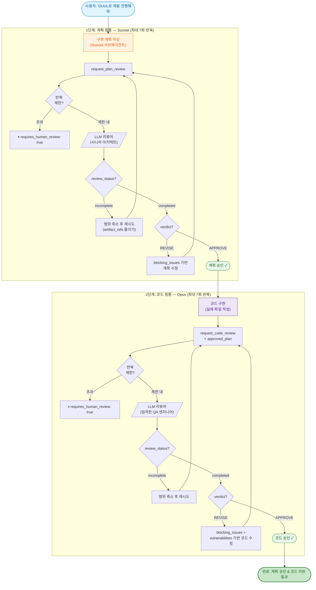

# DUUL

**D**ual-phase **U**pfront-plan & **U**nit-verify **L**oop — LLM을 개발 계획 및 코드의 리뷰어로 활용하는 MCP 서버. OpenAI, Anthropic, Google, OpenRouter 및 OpenAI 호환 프로바이더를 지원합니다.

> [English README](./README.md)

---

## 개요

DUUL은 [Model Context Protocol](https://modelcontextprotocol.io/) 서버로, MCP 클라이언트(Claude Desktop, Claude Code 등)가 외부 LLM에 구조화된 리뷰를 요청할 수 있게 합니다. **2단계 리뷰 루프**를 구현합니다:

1. **Upfront-plan 리뷰** -- 시니어 아키텍트 페르소나가 코드 작성 전에 구현 계획을 검토합니다.
2. **Unit-verify 리뷰** -- 엄격한 QA 엔지니어 페르소나가 승인된 계획 대비 코드를 검토합니다.

호출 에이전트는 각 단계에서 `APPROVE` 판정을 받을 때까지 리뷰어와 반복하고, 이후 다음 단계로 진행합니다. 이를 통해 한 LLM이 다른 LLM의 작업을 검증하는 크로스 모델 리뷰 워크플로우를 만듭니다.

**토큰 효율 설계:** 1단계(계획 작성)는 Sonnet급 서브에이전트에 위임합니다 — 리뷰어가 계획의 문제를 잡아주므로 충분합니다. 2단계(코드 구현)는 최대 코드 품질을 위해 Opus에서 실행됩니다. 이를 통해 1단계 토큰 비용이 약 80% 절감됩니다.

리뷰어는 **워크스페이스 인식 파일 탐색** 기능을 갖추고 있어, `workspace_root`가 주어지면 7개의 내장 도구(파일 읽기, 코드 검색, 디렉토리 목록 등)를 사용하여 정보에 기반한 리뷰 결정을 내립니다.

---

## 설치

### 사전 요구 사항

- **Node.js 20+**
- 지원되는 프로바이더 중 하나 이상의 API 키 (OpenAI, Anthropic, Google 또는 OpenRouter)
- **권장: [ripgrep](https://github.com/BurntSushi/ripgrep) (`rg`)** — 리뷰어의 워크스페이스 탐색 시 더 빠른 코드 검색을 위해. 미설치 시 `git grep` 또는 `grep`으로 폴백되며, 대규모 코드베이스에서 상당히 느려집니다.

```bash
# macOS
brew install ripgrep

# Ubuntu / Debian
sudo apt install ripgrep

# Windows (scoop)
scoop install ripgrep
```

### npm에서 설치 (권장)

```bash
claude mcp add duul \
  -e OPENAI_API_KEY=sk-... \
  -- npx -y @planningo/duul
```

또는 프로젝트 레벨 `.mcp.json` 파일에 수동으로 추가합니다:

```json
{
  "mcpServers": {
    "duul": {
      "command": "npx",
      "args": ["-y", "@planningo/duul"],
      "env": {
        "OPENAI_API_KEY": "sk-..."
      }
    }
  }
}
```

### Claude Desktop에서 설정

`claude_desktop_config.json`에 다음을 추가합니다:

```json
{
  "mcpServers": {
    "duul": {
      "command": "npx",
      "args": ["-y", "@planningo/duul"],
      "env": {
        "OPENAI_API_KEY": "sk-...",
        "REVIEW_PROVIDER": "openai"
      }
    }
  }
}
```

### 소스에서 빌드 (개발용)

```bash
git clone https://github.com/Planningo/duul.git
cd duul
npm install
npm run build
```

그런 다음 MCP 설정에서 `npx -y @planningo/duul` 대신 `node /absolute/path/to/duul/build/index.js`를 사용하세요.

설치 후, 자연어로 요청하면 됩니다: **"DUUL로 개발 진행해줘"** 또는 **"run DUUL"**.

---

## 설정

### 환경 변수

모든 설정은 MCP `env` 블록을 통해 전달합니다 (`.env` 파일이 아님).

#### 프로바이더 & 모델

| 변수 | 필수 | 기본값 | 설명 |
|------|------|--------|------|
| `REVIEW_PROVIDER` | 아니오 | `openai` | 프로바이더: `openai`, `anthropic`, `google`, `openrouter`, `compatible` |
| `REVIEW_MODEL` | 아니오 | 프로바이더 기본값 | 모델 ID (예: `gpt-5.4`, `claude-opus-4-20250514`, `gemini-3.1-pro-preview`) |
| `OPENAI_API_KEY` | 조건부 | -- | `openai` 또는 `compatible` 프로바이더 사용 시 필수 |
| `ANTHROPIC_API_KEY` | 조건부 | -- | `anthropic` 프로바이더 사용 시 필수 |
| `GOOGLE_API_KEY` | 조건부 | -- | `google` 프로바이더 사용 시 필수 |
| `OPENROUTER_API_KEY` | 조건부 | -- | `openrouter` 프로바이더 사용 시 필수 |
| `REVIEW_API_KEY` | 아니오 | -- | `compatible` 프로바이더용 API 키 (`OPENAI_API_KEY`로 폴백) |

프로바이더별 기본 모델:
- **OpenAI:** `gpt-5.4`
- **Anthropic:** `claude-opus-4-20250514`
- **Google:** `gemini-3.1-pro-preview`

#### 반복 제한

각 단계에는 최대 리뷰 반복 횟수가 있습니다. 초과하면 서버가 `requires_human_review: true`를 반환하여 사람에게 에스컬레이션합니다.

| 변수 | 기본값 | 설명 |
|------|--------|------|
| `MAX_PLAN_REVIEW_ITERATIONS` | `7` | 사람 개입 전 최대 계획 리뷰 횟수 |
| `MAX_CODE_REVIEW_ITERATIONS` | `7` | 사람 개입 전 최대 코드 리뷰 횟수 |
| `MAX_PARTITION_ITERATIONS` | `5` | 사람 개입 전 최대 실행 분할 횟수 |

**예시: 복잡한 프로젝트를 위한 넉넉한 제한**

```json
{
  "mcpServers": {
    "duul": {
      "command": "node",
      "args": ["/absolute/path/to/duul/build/index.js"],
      "env": {
        "OPENAI_API_KEY": "sk-...",
        "MAX_PLAN_REVIEW_ITERATIONS": "10",
        "MAX_CODE_REVIEW_ITERATIONS": "10",
        "MAX_PARTITION_ITERATIONS": "7"
      }
    }
  }
}
```

**예시: 빠른 작업을 위한 타이트한 제한**

```json
{
  "env": {
    "MAX_PLAN_REVIEW_ITERATIONS": "3",
    "MAX_CODE_REVIEW_ITERATIONS": "3"
  }
}
```

#### 리뷰어 파일 읽기 바이트 예산

리뷰어가 리뷰 한 번에 파일 탐색 도구로 가져올 수 있는 누적 바이트에 대한 **opt-in 상한**입니다. 설정하면 한도 초과 시 이후 도구 호출이 "예산 소진" 메시지를 반환해 리뷰어가 추가 파일을 요청하지 않고 판정을 제출합니다.

| 변수 | 기본값 | 설명 |
|------|--------|------|
| `DUUL_MAX_REVIEWER_BYTES` | _(미설정 = 무제한)_ | 리뷰 호출 한 번당 리뷰어 파일 도구가 반환하는 최대 누적 바이트 |

기본값은 **미설정(무제한)**입니다 — 초기 측정에서 200KB 기본 cap이 code_review의 약 1/3을 불필요한 REVISE로 몰아 라운드가 오히려 늘었습니다. cap을 쓰고 싶다면 명시적으로 설정하세요. 비용 민감한 사용자는 `200000`–`500000` 범위에서 시작해 리뷰 복잡도에 따라 조정하는 것을 권장합니다.

#### 요청별 오버라이드

개별 리뷰 호출에서 `max_review_iterations` 입력 파라미터로 반복 제한을 오버라이드할 수 있습니다 (범위: 1–20). 환경 변수보다 우선합니다.

```json
{
  "plan": "...",
  "max_review_iterations": 3,
  "iteration_count": 1
}
```

**우선순위:** 요청별 `max_review_iterations` > 환경 변수 > 기본값.

### 요청별 리뷰어 설정

각 리뷰 요청에 `reviewer_config` 객체를 포함하여 프로바이더와 모델을 오버라이드할 수 있습니다:

```json
{
  "reviewer_config": {
    "provider": "anthropic",
    "model": "claude-opus-4-20250514",
    "temperature": 0.3,
    "top_p": 0.2
  }
}
```

| 필드 | 타입 | 기본값 | 설명 |
|------|------|--------|------|
| `provider` | `string` | env / `openai` | `openai`, `anthropic`, `google`, `openrouter`, `compatible` |
| `model` | `string \| { plan?, code?, partition? }` | env / 프로바이더 기본값 | 모델 식별자. 객체로 전달하면 도구마다 다른 모델을 사용할 수 있습니다(아래 참고). |
| `base_url` | `string` | -- | 커스텀 API 엔드포인트 (`compatible` 또는 자체 호스팅용) |
| `api_key` | `string` | -- | 요청별 API 키 (환경 변수 오버라이드) |
| `temperature` | `number` | `0.2` | 샘플링 온도 (0–2) |
| `top_p` | `number` | `0.1` | 핵 샘플링 (0–1) |

#### 도구별 모델 오버라이드

`model`에는 문자열 하나(모든 리뷰 도구에 적용) 또는 도구별 오버라이드 객체를 전달할 수 있습니다. 객체에 지정되지 않은 도구는 `REVIEW_MODEL`/프로바이더 기본값으로 폴백합니다.

```json
{
  "reviewer_config": {
    "model": {
      "code": "claude-opus-4-20250514"
    }
  }
}
```

**의도한 방향은 약화가 아닌 강화입니다.** 계획 단계의 결함은 구현 전체로 증폭되므로 `plan`의 기본값은 여전히 강력한 모델에 유지해야 합니다. 이 기능은 `plan`은 기본값을 유지하고 `code_review`에 Opus처럼 더 강한 모델을 쓰고 싶은 사용자를 위한 것이지, `plan`을 약화시켜 비용을 줄이려는 용도가 아닙니다.

---

## 작동 방식

### 전체 리뷰 루프



### 선택: 실행 파티션 (멀티 에이전트)

1단계 승인 후, 대규모 계획은 2단계 전에 병렬화 가능한 서브태스크로 분할할 수 있습니다:


### DUUL 트리거 방법

대화 중에 **"DUUL"** (또는 **"두울"**)을 언급하면 활성화됩니다.

**트리거 예시:**
- "DUUL로 개발 진행해줘", "두울 돌려줘", "DUUL로 해줘"
- "run DUUL", "use DUUL for this", "start DUUL"

**트리거가 아닌 것** (에이전트가 직접 처리하는 일반 요청):
- "코드 리뷰해줘", "이거 확인해봐", "내 계획 봐줘"

---

## 도구

### `request_plan_review` -- The Architect

DUUL 1단계: LLM 시니어 소프트웨어 아키텍트에게 개발 계획의 리뷰를 요청합니다.

**입력 스키마:**

| 필드 | 타입 | 필수 | 설명 |
|------|------|------|------|
| `plan` | `string` | 예 | 상세한 구현 계획 |
| `project_context` | `object` | 아니오 | 구조화된 프로젝트 컨텍스트 |
| `constraints` | `string[]` | 아니오 | 특수 제약 조건: 성능, 메모리, 보안 등 |
| `notes_to_reviewer` | `string` | 아니오 | 리뷰어에게 전달할 컨텍스트 또는 반박 |
| `workspace_root` | `string` | 아니오 | 워크스페이스 루트 절대 경로 (파일 탐색 활성화) |
| `working_directories` | `string[]` | 아니오 | 파일 접근을 제한할 하위 디렉토리 |
| `linked_roots` | `string[]` | 아니오 | 읽기 전용 외부 워크스페이스 루트 (최대 5개) |
| `artifact_refs` | `Array<{ path, reason, priority }>` | 아니오 | 우선순위가 있는 중요 파일 참조 (최대 30개) |
| `tracked_only` | `boolean` | 아니오 | git 추적 파일만 접근 허용 |
| `previous_review_id` | `string` | 아니오 | 이전 리뷰 호출의 응답 ID |
| `iteration_count` | `number` | 아니오 | 현재 반복 횟수 |
| `max_review_iterations` | `number` | 아니오 | 반복 제한 오버라이드 (1–20) |
| `reviewer_config` | `object` | 아니오 | 요청별 리뷰어 설정 |

**출력 스키마:**

| 필드 | 타입 | 설명 |
|------|------|------|
| `verdict` | `"APPROVE" \| "REVISE"` | 최종 판정 |
| `review_status` | `"completed" \| "incomplete"` | 리뷰 완료 여부 |
| `confidence` | `number` (0-1) | 판정에 대한 신뢰도, 참고용 |
| `requires_human_review` | `boolean` | 사람의 검토가 필요한지 여부 |
| `architectural_analysis` | `string` | 구조적 장단점 분석 |
| `blocking_issues` | `Array<{ description, suggestion }>` | 진행 전 반드시 수정해야 하는 이슈 |
| `non_blocking_suggestions` | `string[]` | 선택적 개선 제안 |
| `edge_cases` | `string[]` | 고려되지 않은 엣지 케이스 |
| `checklist_for_implementation` | `string[]` | 구현 시 반드시 따라야 할 체크리스트 |
| `review_id` | `string` | 라운드 간 컨텍스트 유지를 위한 응답 ID |
| `iteration_count` | `number` | 현재 반복 횟수 |
| `iteration_limit` | `number` | 이 단계의 유효 반복 제한 |
| `iteration_limit_reached` | `boolean` | 반복 제한에 도달했는지 여부 |

### `request_code_review` -- The Debugger

DUUL 2단계: LLM 엄격한 QA 엔지니어에게 코드 리뷰를 요청합니다. 이전에 승인된 계획이 필요합니다.

**입력 스키마:**

| 필드 | 타입 | 필수 | 설명 |
|------|------|------|------|
| `code` | `string` | 예 | 리뷰할 코드 |
| `approved_plan` | `string` | 예 | 이 코드가 구현하는 승인된 계획 |
| `file_path` | `string` | 아니오 | 맥락에 맞는 피드백을 위한 파일 경로 |
| `dependencies` | `object` | 아니오 | 관련 라이브러리 버전 정보 |
| `relevant_code` | `Array<{ file_path, code }>` | 아니오 | 관련 코드 스니펫 |
| `notes_to_reviewer` | `string` | 아니오 | 리뷰어에게 전달할 컨텍스트 또는 반박 |
| `workspace_root` | `string` | 아니오 | 워크스페이스 루트 절대 경로 |
| `working_directories` | `string[]` | 아니오 | 파일 접근을 제한할 하위 디렉토리 |
| `artifact_refs` | `Array<{ path, reason, priority }>` | 아니오 | 중요 파일 참조 (최대 30개) |
| `previous_review_id` | `string` | 아니오 | 이전 리뷰 호출의 응답 ID |
| `iteration_count` | `number` | 아니오 | 현재 반복 횟수 |
| `max_review_iterations` | `number` | 아니오 | 반복 제한 오버라이드 (1–20) |
| `reviewer_config` | `object` | 아니오 | 요청별 리뷰어 설정 |

**출력 스키마:**

| 필드 | 타입 | 설명 |
|------|------|------|
| `verdict` | `"APPROVE" \| "REVISE"` | 최종 판정 |
| `review_status` | `"completed" \| "incomplete"` | 리뷰 완료 여부 |
| `confidence` | `number` (0-1) | 판정에 대한 신뢰도, 참고용 |
| `requires_human_review` | `boolean` | 사람의 검토가 필요한지 여부 |
| `logic_validation` | `string` | 코드가 승인된 계획을 얼마나 정확히 구현하는지 |
| `blocking_issues` | `Array<{ description, suggestion }>` | 진행 전 반드시 수정해야 하는 이슈 |
| `non_blocking_suggestions` | `string[]` | 선택적 개선 제안 |
| `vulnerabilities` | `Array<{ type, description, severity }>` | 보안/성능 취약점 |
| `optimized_snippet` | `string \| null` | 최적화된 코드 블록 |
| `review_id` | `string` | 라운드 간 컨텍스트 유지를 위한 응답 ID |
| `iteration_count` | `number` | 현재 반복 횟수 |
| `iteration_limit` | `number` | 이 단계의 유효 반복 제한 |
| `iteration_limit_reached` | `boolean` | 반복 제한에 도달했는지 여부 |

---

## 워크스페이스 범위

`workspace_root`가 제공되면 리뷰어는 7개의 파일 탐색 도구에 접근할 수 있습니다:

| 도구 | 설명 |
|------|------|
| `read_file` | 전체 파일 내용 읽기 (50KB 초과 시 경고) |
| `list_directory` | 파일 및 디렉토리 목록 |
| `search_in_files` | 파일 전체에서 정규식 검색 (`rg` > `git grep` > `grep`) |
| `read_file_range` | 특정 줄 범위 읽기 (최대 200줄) |
| `stat_file` | 파일 크기, 수정 시간, 타입 조회 |
| `read_json` | JSON 파일 읽기 (선택적 JSON 포인터) |
| `list_tracked_files` | git 추적 파일 목록 (선택적 접두사 필터) |

### 보안

- 차단 경로: `.git/`, `build/`, `dist/`, `*.log`
- `linked_roots`는 읽기 전용
- `tracked_only: true` 시 git 추적 파일만 접근 가능
- 심볼릭 링크 탈출 방지
- 시스템 디렉토리 및 얕은 경로 (깊이 3 미만) 거부

---

## 프로바이더 기능 매트릭스

| 프로바이더 | 구조화된 출력 | 도구 호출 | 이전 응답 ID | JSON 스키마 엄격 |
|-----------|-------------|---------|------------|----------------|
| **OpenAI** | 예 | 예 | 예 | 예 |
| **Anthropic** | 아니오 (JSON 프롬프트 + zod) | 아니오 | 아니오 | 아니오 |
| **Google** | 아니오 (JSON 모드 + zod) | 아니오 | 아니오 | 아니오 |
| **OpenRouter** | 예 (OpenAI API 경유) | 예 | 예 | 예 |
| **Compatible** | 예 (OpenAI API 경유) | 예 | 예 | 예 |

**성능 저하 동작:**
- **구조화된 출력 미지원:** JSON 프롬프팅 + zod 검증 폴백.
- **도구 호출 미지원:** 리뷰어가 워크스페이스를 탐색할 수 없음. `relevant_code`와 `artifact_refs`로 보완.
- **이전 응답 ID 미지원:** 각 리뷰 호출이 독립적 (대화 기억 없음).

---

## 아키텍처

```
src/
  index.ts                        진입점. MCP 서버 + stdio 트랜스포트.
  schemas/
    common.ts                     공유 스키마 (ArtifactRef, ReviewerConfig, IterationMeta).
    plan-review.ts                계획 리뷰 입출력 스키마.
    code-review.ts                코드 리뷰 입출력 스키마.
    execution-partition.ts        실행 분할 입출력 스키마.
  prompts/
    plan-review-system.ts         시니어 아키텍트 시스템 프롬프트.
    code-review-system.ts         엄격한 QA 엔지니어 시스템 프롬프트.
    execution-partition-system.ts 프로젝트 매니저 시스템 프롬프트.
  services/
    reviewer.ts                   프로바이더 팩토리 + callReview() 디스패처.
    review-limits.ts              반복 제한 해석 및 적용.
    filesystem.ts                 워크스페이스 범위 파일 작업 + 보안.
    providers/
      types.ts                    ReviewerProvider 인터페이스 + 기능 선언.
      openai.ts                   OpenAI: 구조화된 출력 + 도구 루프.
      anthropic.ts                Anthropic: JSON 프롬프트 + zod.
      google.ts                   Google: JSON 모드 + zod.
  tools/
    plan-review.ts                request_plan_review MCP 도구.
    code-review.ts                request_code_review MCP 도구.
    execution-partition.ts        request_execution_partition MCP 도구.
```

---

## 라이선스

MIT
