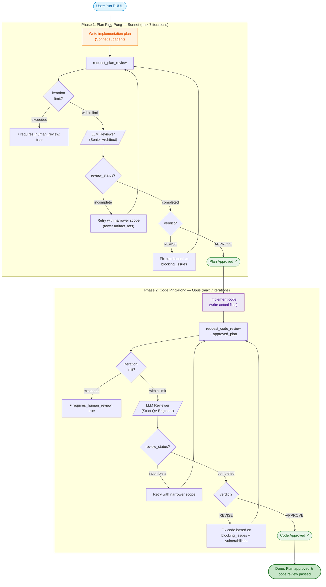

# DUUL

**D**ual-phase **U**pfront-plan & **U**nit-verify **L**oop — an MCP server that uses LLMs as peer reviewers for development plans and code. Supports OpenAI, Anthropic, Google, OpenRouter, and any OpenAI-compatible provider.

> [한국어 README](./README.ko.md)

---

## Overview

DUUL is a [Model Context Protocol](https://modelcontextprotocol.io/) server that enables any MCP client (such as Claude Desktop or Claude Code) to request structured peer reviews from external LLMs. It implements a **2-phase review loop**:

1. **Upfront-plan Review** -- A Senior Architect persona reviews the implementation plan before any code is written.
2. **Unit-verify Review** -- A Strict QA Engineer persona reviews the code against the approved plan.

The calling agent iterates with the reviewer on each phase until it receives an `APPROVE` verdict, then moves to the next phase. This creates a cross-model peer review workflow where one LLM checks the work of another.

**Token-efficient by design:** Phase 1 (plan authoring) is delegated to a Sonnet-class subagent, since the reviewer catches any plan issues anyway. Phase 2 (code implementation) stays on Opus for maximum code quality. This typically reduces Phase 1 token costs by ~80%.

The reviewer has **workspace-aware file exploration** -- when given a `workspace_root`, it can autonomously browse the codebase using 7 built-in tools (read files, search code, list directories, etc.) to make informed review decisions instead of speculating.

---

## Installation

### Prerequisites

- **Node.js 20+**
- API key for at least one supported provider (OpenAI, Anthropic, Google, or OpenRouter)
- **Recommended: [ripgrep](https://github.com/BurntSushi/ripgrep) (`rg`)** for faster code search within the reviewer's workspace exploration. Without it, the reviewer falls back to `git grep` or `grep`, which are significantly slower on large codebases.

```bash
# macOS
brew install ripgrep

# Ubuntu / Debian
sudo apt install ripgrep

# Windows (scoop)
scoop install ripgrep
```

### Build from Source

```bash
git clone https://github.com/Planningo/duul.git
cd duul
npm install
npm run build
```

### Setup with Claude Code

```bash
claude mcp add duul \
  -e OPENAI_API_KEY=sk-... \
  -- node /absolute/path/to/duul/build/index.js
```

Or add manually to your project-level `.mcp.json`:

```json
{
  "mcpServers": {
    "duul": {
      "command": "node",
      "args": ["/absolute/path/to/duul/build/index.js"],
      "env": {
        "OPENAI_API_KEY": "sk-..."
      }
    }
  }
}
```

### Setup with Claude Desktop

Add the following to your `claude_desktop_config.json`:

```json
{
  "mcpServers": {
    "duul": {
      "command": "node",
      "args": ["/absolute/path/to/duul/build/index.js"],
      "env": {
        "OPENAI_API_KEY": "sk-...",
        "REVIEW_PROVIDER": "openai"
      }
    }
  }
}
```

Replace `/absolute/path/to/duul` with the actual path to this project on your system.

Once installed, just ask in natural language: **"run DUUL"** or **"use DUUL for this"**.

---

## Configuration

### Environment Variables

All configuration is done via environment variables, passed through the MCP `env` block (not a `.env` file).

#### Provider & Model

| Variable | Required | Default | Description |
|----------|----------|---------|-------------|
| `REVIEW_PROVIDER` | No | `openai` | Provider: `openai`, `anthropic`, `google`, `openrouter`, `compatible` |
| `REVIEW_MODEL` | No | Provider default | Model ID (e.g. `gpt-5.4`, `claude-opus-4-20250514`, `gemini-3.1-pro-preview`) |
| `OPENAI_API_KEY` | Conditional | -- | Required for `openai` or `compatible` provider |
| `ANTHROPIC_API_KEY` | Conditional | -- | Required for `anthropic` provider |
| `GOOGLE_API_KEY` | Conditional | -- | Required for `google` provider |
| `OPENROUTER_API_KEY` | Conditional | -- | Required for `openrouter` provider |
| `REVIEW_API_KEY` | No | -- | API key for `compatible` provider (falls back to `OPENAI_API_KEY`) |

Default models per provider:
- **OpenAI:** `gpt-5.4`
- **Anthropic:** `claude-opus-4-20250514`
- **Google:** `gemini-3.1-pro-preview`

#### Iteration Limits

Each phase has a maximum number of review iterations. When exceeded, the server returns `requires_human_review: true` so the caller can escalate to a human.

| Variable | Default | Description |
|----------|---------|-------------|
| `MAX_PLAN_REVIEW_ITERATIONS` | `7` | Max plan review rounds before human escalation |
| `MAX_CODE_REVIEW_ITERATIONS` | `7` | Max code review rounds before human escalation |
| `MAX_PARTITION_ITERATIONS` | `5` | Max execution partition rounds before human escalation |

**Example: relaxed limits for complex projects**

```json
{
  "mcpServers": {
    "duul": {
      "command": "node",
      "args": ["/absolute/path/to/duul/build/index.js"],
      "env": {
        "OPENAI_API_KEY": "sk-...",
        "MAX_PLAN_REVIEW_ITERATIONS": "10",
        "MAX_CODE_REVIEW_ITERATIONS": "10",
        "MAX_PARTITION_ITERATIONS": "7"
      }
    }
  }
}
```

**Example: tight limits for quick tasks**

```json
{
  "env": {
    "MAX_PLAN_REVIEW_ITERATIONS": "3",
    "MAX_CODE_REVIEW_ITERATIONS": "3"
  }
}
```

#### Per-Request Override

You can also override the iteration limit on individual review calls via the `max_review_iterations` input parameter (range: 1–20). This takes priority over the environment variable.

```json
{
  "plan": "...",
  "max_review_iterations": 3,
  "iteration_count": 1
}
```

**Priority order:** per-request `max_review_iterations` > environment variable > default.

### Per-Request Reviewer Config

Each review request can include a `reviewer_config` object to override provider and model settings:

```json
{
  "reviewer_config": {
    "provider": "anthropic",
    "model": "claude-opus-4-20250514",
    "temperature": 0.3,
    "top_p": 0.2
  }
}
```

| Field | Type | Default | Description |
|-------|------|---------|-------------|
| `provider` | `string` | env / `openai` | `openai`, `anthropic`, `google`, `openrouter`, `compatible` |
| `model` | `string` | env / provider default | Model identifier |
| `base_url` | `string` | -- | Custom API endpoint (for `compatible` or self-hosted) |
| `api_key` | `string` | -- | Per-request API key (overrides env) |
| `temperature` | `number` | `0.2` | Sampling temperature (0–2) |
| `top_p` | `number` | `0.1` | Nucleus sampling (0–1) |

---

## How It Works

### Full Review Loop



### Optional: Execution Partition (Multi-Agent)

After Phase 1 approval, large plans can be split into parallelizable subtasks before Phase 2:


### Triggering DUUL

The DUUL loop is activated by **mentioning "DUUL"** in conversation. The server embeds workflow instructions that the MCP client picks up automatically.

**Trigger examples:**
- "run DUUL", "use DUUL for this", "start DUUL"

**Not triggers** (these are normal requests the agent handles itself):
- "review my code", "check this", "look over my plan"

---

## Tools

### `request_plan_review` -- The Architect

DUUL Phase 1: Submit a development plan for review by an LLM acting as a Senior Software Architect.

**Input Schema:**

| Field | Type | Required | Description |
|-------|------|----------|-------------|
| `plan` | `string` | Yes | Detailed implementation plan |
| `project_context` | `object` | No | Structured project context |
| `project_context.file_tree` | `string` | No | Project file tree summary (max 2000 chars) |
| `project_context.changed_files` | `string[]` | No | List of files related to this change |
| `project_context.package_versions` | `Record<string, string>` | No | Key package versions |
| `project_context.relevant_code` | `Array<{ file_path, code }>` | No | Existing code snippets for context |
| `constraints` | `string[]` | No | Special constraints: performance, memory, security, etc. |
| `notes_to_reviewer` | `string` | No | Context or rebuttals for the reviewer |
| `workspace_root` | `string` | No | Absolute path to workspace root (enables file exploration) |
| `project_root` | `string` | No | **Deprecated** -- use `workspace_root` |
| `working_directories` | `string[]` | No | Subdirectories to restrict file access to |
| `linked_roots` | `string[]` | No | Read-only external workspace roots (max 5) |
| `changed_files` | `string[]` | No | Files changed in this review scope (top-level) |
| `entrypoints` | `string[]` | No | Entry point files the reviewer should start from |
| `artifact_refs` | `Array<{ path, reason, priority }>` | No | Important file references with priority (max 30) |
| `tracked_only` | `boolean` | No | Only allow access to git-tracked files |
| `git_head_sha` | `string` | No | Current git HEAD SHA |
| `previous_git_head_sha` | `string` | No | Previous review round's git HEAD SHA |
| `previous_review_id` | `string` | No | Response ID from previous review call |
| `iteration_count` | `number` | No | Current iteration number (caller tracks, server enforces limit) |
| `max_review_iterations` | `number` | No | Override default iteration limit (1–20) |
| `reviewer_config` | `object` | No | Per-request reviewer configuration |

**Output Schema:**

| Field | Type | Description |
|-------|------|-------------|
| `verdict` | `"APPROVE" \| "REVISE"` | Final verdict |
| `review_status` | `"completed" \| "incomplete"` | Whether the review was fully completed |
| `confidence` | `number` (0-1) | Confidence in the verdict, advisory only |
| `requires_human_review` | `boolean` | Whether a human should review this |
| `architectural_analysis` | `string` | Structural pros/cons analysis |
| `blocking_issues` | `Array<{ description, suggestion }>` | Issues that must be fixed before proceeding |
| `merge_blockers` | `Array<{ description, suggestion }> \| null` | Subset of blocking_issues that should block merge |
| `non_blocking_suggestions` | `string[]` | Optional improvement suggestions |
| `edge_cases` | `string[]` | Unconsidered edge cases |
| `checklist_for_implementation` | `string[]` | Must-follow checklist for implementation |
| `follow_up_todos` | `string[] \| null` | Follow-up tasks after implementation |
| `missing_context` | `string[] \| null` | Files or context the reviewer could not access |
| `evidence_files` | `string[] \| null` | Files the reviewer examined as evidence |
| `used_tools` | `string[] \| null` | Tool calls made during review |
| `tool_exhaustion_reason` | `"budget" \| "repeat" \| "round_limit" \| null` | Why the tool loop was exhausted (if incomplete) |
| `review_id` | `string` | Response ID for maintaining context across rounds |
| `iteration_count` | `number` | Current iteration count (echoed back) |
| `iteration_limit` | `number` | Effective iteration limit for this phase |
| `iteration_limit_reached` | `boolean` | Whether the iteration limit was reached |
| `parallelization_hint` | `"serial" \| "parallel" \| "hybrid" \| null` | Whether the plan can be parallelized |
| `coordination_risks` | `string[] \| null` | Risks if parallelizing |
| `recommended_subtask_boundaries` | `string[] \| null` | Suggested subtask splits |

### `request_code_review` -- The Debugger

DUUL Phase 2: Submit code for review by an LLM acting as a Strict QA Engineer. Requires the previously approved plan.

**Input Schema:**

| Field | Type | Required | Description |
|-------|------|----------|-------------|
| `code` | `string` | Yes | The code to review |
| `approved_plan` | `string` | Yes | The previously approved plan this code implements |
| `file_path` | `string` | No | File path for contextual feedback |
| `dependencies` | `object` | No | Related library version info |
| `relevant_code` | `Array<{ file_path, code }>` | No | Related code snippets for context |
| `notes_to_reviewer` | `string` | No | Context or rebuttals for the reviewer |
| `workspace_root` | `string` | No | Absolute path to workspace root (enables file exploration) |
| `working_directories` | `string[]` | No | Subdirectories to restrict file access to |
| `linked_roots` | `string[]` | No | Read-only external workspace roots (max 5) |
| `changed_files` | `string[]` | No | Files changed in this review scope |
| `entrypoints` | `string[]` | No | Entry point files |
| `artifact_refs` | `Array<{ path, reason, priority }>` | No | Important file references (max 30) |
| `tracked_only` | `boolean` | No | Only allow access to git-tracked files |
| `git_head_sha` | `string` | No | Current git HEAD SHA |
| `previous_review_id` | `string` | No | Response ID from previous review call |
| `iteration_count` | `number` | No | Current iteration number |
| `max_review_iterations` | `number` | No | Override default iteration limit (1–20) |
| `reviewer_config` | `object` | No | Per-request reviewer configuration |

**Output Schema:**

| Field | Type | Description |
|-------|------|-------------|
| `verdict` | `"APPROVE" \| "REVISE"` | Final verdict |
| `review_status` | `"completed" \| "incomplete"` | Whether the review was fully completed |
| `confidence` | `number` (0-1) | Confidence in the verdict, advisory only |
| `requires_human_review` | `boolean` | Whether a human should review this |
| `logic_validation` | `string` | How accurately the code implements the approved plan |
| `blocking_issues` | `Array<{ description, suggestion }>` | Issues that must be fixed |
| `merge_blockers` | `Array<{ description, suggestion }> \| null` | Subset that should block merge |
| `non_blocking_suggestions` | `string[]` | Optional improvement suggestions |
| `vulnerabilities` | `Array<{ type, description, severity }>` | Security/performance vulnerabilities |
| `optimized_snippet` | `string \| null` | Optimized code block, or `null` |
| `follow_up_todos` | `string[] \| null` | Follow-up tasks |
| `missing_context` | `string[] \| null` | Context the reviewer could not access |
| `review_id` | `string` | Response ID for context continuity |
| `iteration_count` | `number` | Current iteration count |
| `iteration_limit` | `number` | Effective iteration limit |
| `iteration_limit_reached` | `boolean` | Whether the limit was reached |

---

## Workspace Scope

When `workspace_root` is provided, the reviewer gains access to 7 file exploration tools:

| Tool | Description |
|------|-------------|
| `read_file` | Read entire file content (warns if > 50KB) |
| `list_directory` | List files and directories |
| `search_in_files` | Regex search across files (uses `rg` > `git grep` > `grep`) |
| `read_file_range` | Read specific line range (max 200 lines) |
| `stat_file` | Get file size, modification time, and type |
| `read_json` | Read JSON file with optional JSON pointer |
| `list_tracked_files` | List git-tracked files with optional prefix filter |

### Security

- Blocked paths: `.git/`, `build/`, `dist/`, `*.log`
- `linked_roots` are read-only
- `tracked_only: true` restricts to git-tracked files only
- Symlink escape from workspace/linked roots is prevented
- System directories and shallow paths (< 3 depth) are rejected

---

## Provider Capability Matrix

| Provider | Structured Outputs | Tool Calling | Previous Response ID | JSON Schema Strict |
|----------|-------------------|-------------|---------------------|-------------------|
| **OpenAI** | Yes | Yes | Yes | Yes |
| **Anthropic** | No (JSON prompt + zod) | No | No | No |
| **Google** | No (JSON mode + zod) | No | No | No |
| **OpenRouter** | Yes (via OpenAI API) | Yes | Yes | Yes |
| **Compatible** | Yes (via OpenAI API) | Yes | Yes | Yes |

**Degradation behavior:**
- **No structured outputs:** JSON prompting + zod validation fallback.
- **No tool calling:** Reviewer cannot explore the workspace. Provide more context via `relevant_code` and `artifact_refs`.
- **No previous response ID:** Each review call is independent (no conversation memory).

---

## Architecture

```
src/
  index.ts                        Entry point. MCP server + stdio transport.
  schemas/
    common.ts                     Shared schemas (ArtifactRef, ReviewerConfig, IterationMeta).
    plan-review.ts                Plan review input/output schemas.
    code-review.ts                Code review input/output schemas.
    execution-partition.ts        Execution partition input/output schemas.
  prompts/
    plan-review-system.ts         Senior Architect system prompt.
    code-review-system.ts         Strict QA Engineer system prompt.
    execution-partition-system.ts Project Manager system prompt.
  services/
    reviewer.ts                   Provider factory + callReview() dispatcher.
    review-limits.ts              Iteration limit resolution and enforcement.
    filesystem.ts                 Workspace-scoped file operations + security.
    providers/
      types.ts                    ReviewerProvider interface + capabilities.
      openai.ts                   OpenAI: structured outputs + tool loop.
      anthropic.ts                Anthropic: JSON prompt + zod.
      google.ts                   Google: JSON mode + zod.
  tools/
    plan-review.ts                request_plan_review MCP tool.
    code-review.ts                request_code_review MCP tool.
    execution-partition.ts        request_execution_partition MCP tool.
```

---

## License

MIT
